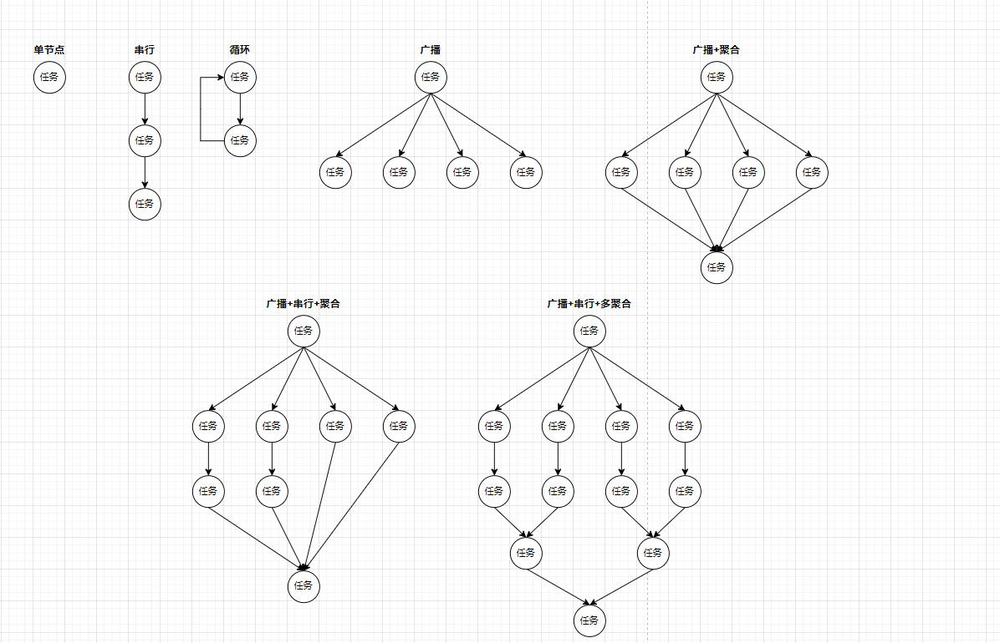

# Xxl Job Extension

xxl-job扩展
###原理
使用asm字节码技术，动态生成xxl-job的任务处理器
###使用
1. 配置扫描的包`job.scan.package`默认值为`yj.job`,在任务类上添加注解@JobComponent
2. 任务类中的public但非static方法会被用来作为xxl-job的处理器
3. 方法上没有@JobDescription注解，则任务名为方法名，也不存在任何父级任务
4. 方法上有@JobDescription注解，可以使用`name`属性指定任务名称，
   1. 配置`parent`属性，则会查找`parent`属性指定的父级任务，父级任务的返回值必须是`String`或`List<String>`类型，当前任务的参数个数必须是一个并且类型是`String`
   2. 父级任务会收集所有的子级任务，把返回值分发到每个子级任务的队列中
   3. 配置`aggregate`属性，则会查找`aggregate`属性指定的聚合任务，聚合任务的参数个数必须是一个并且类型是`String`，当前任务的返回值类型必须是`String`
   4. 所有配置相同`aggregate`属性的的任务，会判断，是否任务已全部完成，如果完成会把返回值分派到`aggregate`指定的聚合任务的队列中
###限制
1. 任务依赖及任务聚合只能在同一个类中
2. 所有配置相同`aggregate`属性的的任务同一批次的返回值必须相同
###支持的任务类型

###### example
原始类
```java
package yj.job;

import yj.job.annotation.JobComponent;
import yj.job.annotation.JobDescription;

/**
 * @author zwk
 * @version 1.0
 * @date 2023/5/31 13:48
 */
@JobComponent
public class TestJob {

    public String testJob1() {
        System.out.println("testJob1");
        return "123";
    }

    @JobDescription(parent = "testJob1")
    public String testJob2(String s) {
        System.out.println("testJob2");
        System.out.println("s = " + s);

        return "456";
    }

    @JobDescription(parent = "testJob1", aggregate = "testJob5")
    public String testJob3(String s) {
        System.out.println("testJob3");
        System.out.println("s = " + s);
        return "456";
    }

    @JobDescription(parent = "testJob2", aggregate = "testJob5")
    public String testJob4(String s) {
        System.out.println("testJob4");
        System.out.println("s = " + s);
        return "456";
    }

    @JobDescription
    public void testJob5(String s) {
        System.out.println("testJob5");
        System.out.println("s = " + s);
    }
}
```
生成类
```java

package yj.job;

import com.xxl.job.core.handler.annotation.XxlJob;
import com.xxl.job.plus.executor.annotation.XxlRegister;
import org.springframework.beans.factory.annotation.Autowired;
import org.springframework.stereotype.Component;

@Component
public final class TestJob$Job$ extends AbstractJob {
    @Autowired
    private TestJob job;

    public TestJob$Job$() {
    }

    @XxlRegister(
        cron = "0/10 * * * * ?",
        author = "以见科技",
        jobDesc = "testJob1",
        jobGroup = "test-job",
        jobGroupTitle = "asdf",
        executorRouteStrategy = "ROUND",
        triggerStatus = 0,
        jobGroupAddressType = 0
    )
    @XxlJob("testJob1")
    public void testJob1$Method$1() {
        String var2 = this.job.testJob1();
        this.leftPush("yj:job:TestJob:testJob2:String,yj:job:TestJob:testJob3:String", var2);
    }

    @XxlRegister(
        cron = "0/10 * * * * ?",
        author = "以见科技",
        jobDesc = "testJob2",
        jobGroup = "test-job",
        jobGroupTitle = "asdf",
        executorRouteStrategy = "ROUND",
        triggerStatus = 0,
        jobGroupAddressType = 0
    )
    @XxlJob("testJob2")
    public void testJob2$Method$2() {
        String var1 = this.popKey("yj:job:TestJob:testJob2:String");

        try {
            String var2 = this.job.testJob2(var1);
            this.leftPush("yj:job:TestJob:testJob4:String", var2);
        } catch (JobException var3) {
            this.leftPush("yj:job:TestJob:testJob2:String", var1);
        }

    }

    @XxlRegister(
        cron = "0/10 * * * * ?",
        author = "以见科技",
        jobDesc = "testJob4",
        jobGroup = "test-job",
        jobGroupTitle = "asdf",
        executorRouteStrategy = "ROUND",
        triggerStatus = 0,
        jobGroupAddressType = 0
    )
    @XxlJob("testJob4")
    public void testJob4$Method$3() {
        String var1 = this.popKey("yj:job:TestJob:testJob4:String");

        try {
            String var2 = this.job.testJob4(var1);
            if (this.jobDone("yj:job:TestJob:testJob5:String:done:", var2, 2)) {
                this.leftPush("yj:job:TestJob:testJob5:String", var2);
            }
        } catch (JobException var3) {
            this.leftPush("yj:job:TestJob:testJob4:String", var1);
        }

    }

    @XxlRegister(
        cron = "0/10 * * * * ?",
        author = "以见科技",
        jobDesc = "testJob3",
        jobGroup = "test-job",
        jobGroupTitle = "asdf",
        executorRouteStrategy = "ROUND",
        triggerStatus = 0,
        jobGroupAddressType = 0
    )
    @XxlJob("testJob3")
    public void testJob3$Method$4() {
        String var1 = this.popKey("yj:job:TestJob:testJob3:String");

        try {
            String var2 = this.job.testJob3(var1);
            if (this.jobDone("yj:job:TestJob:testJob5:String:done:", var2, 2)) {
                this.leftPush("yj:job:TestJob:testJob5:String", var2);
            }
        } catch (JobException var3) {
            this.leftPush("yj:job:TestJob:testJob3:String", var1);
        }

    }

    @XxlRegister(
        cron = "0/10 * * * * ?",
        author = "以见科技",
        jobDesc = "testJob5",
        jobGroup = "test-job",
        jobGroupTitle = "asdf",
        executorRouteStrategy = "ROUND",
        triggerStatus = 0,
        jobGroupAddressType = 0
    )
    @XxlJob("testJob5")
    public void testJob5$Method$5() {
        String var1 = this.popKey("yj:job:TestJob:testJob5:String");

        try {
            this.job.testJob5(var1);
        } catch (JobException var3) {
            this.leftPush("yj:job:TestJob:testJob5:String", var1);
        }

    }
}
```